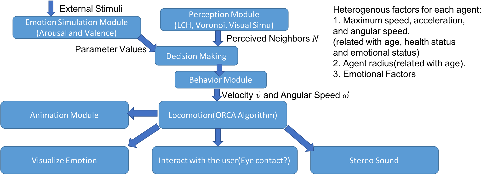

# TODO List

## 阶段1：

1. 基于RVO2的框架争取复现 Wolf-pack(Canis Lupus) hunting strategies emerge from simple rules in computational simulations 中的结果，考虑其灵活性和可扩展性，比如调整不同的参数可以实现什么样的结果，如何引入异质(heterogenous)的因素。

2. 在上述基础下，设计实现一个狼群体狩猎多个猎物的行为模型。这个模型应体现如下行为学研究结果：狩猎行为包含approach, attack group, attack individual三个步骤，并且狼会从群体中挑选出最容易的猎物发起进攻。

3. 基于RVO2的框架争取复现 Intermittent collective dynamics emerge from conflicting imperatives in sheep herds 中的结果，考虑其灵活性和可扩展性，比如调整不同的参数可以实现什么样的结果，如何引入异质(heterogenous)的因素。

4. 综合考虑有关Selfish Herd Theory的研究，实现一个有蹄类食草动物面对捕食者时的移动和反应的模型。

5.  基于下图在Unity3D上搭建一个灵活，可扩展的动物行为模拟框架，可以集成以下各种实现结果。

     

6. 实现动物的不同感知模块，返回群体中动物所感知到的邻居的位置、速度等信息，方法包括Vonoroi图算法，LCH算法。

7. 引入真实的动物模型和动画，构建虚拟场景，设计视觉效果。

8. 总结成一个可以运行的模拟框架，运行得到逼真有趣的结果。

## 阶段2：（暂定）

1. 在上述框架中设计一个情绪模拟模块，让虚拟动物个体具有情绪，设计不同场景观察实验结果。
2. 在上述框架中加入玩家，让虚拟动物随着玩家化身的行动做出行动，设计不同场景观察实验结果。
3. 增加考虑玩家化身表达自己情绪的方式